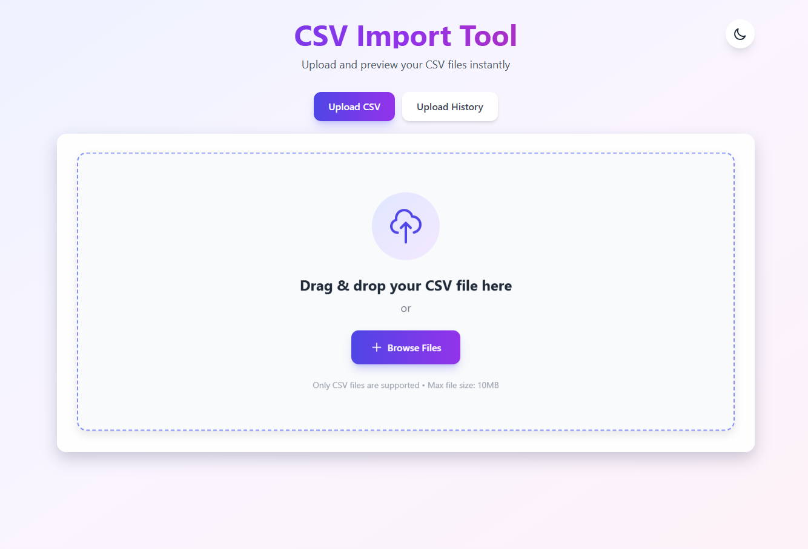
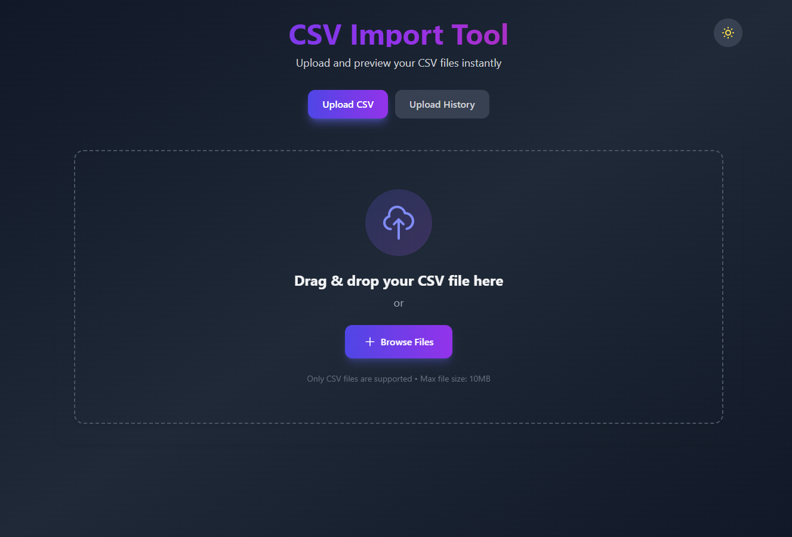
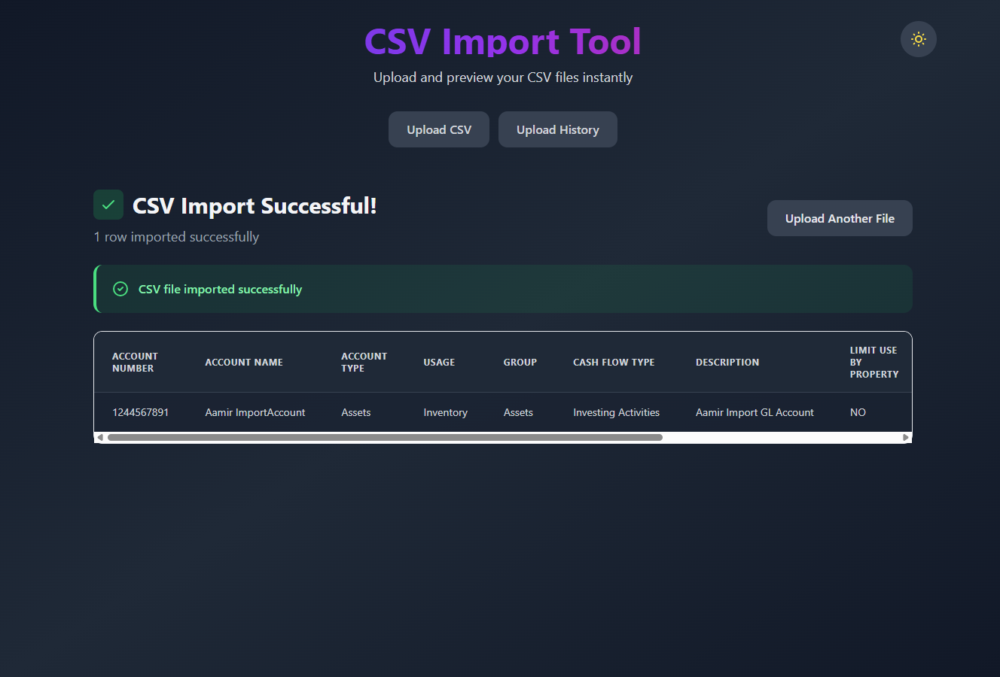
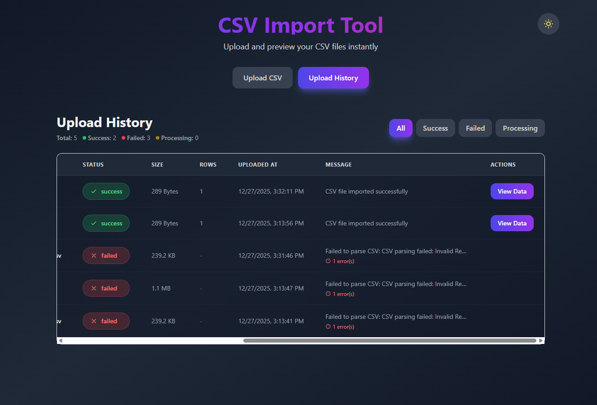
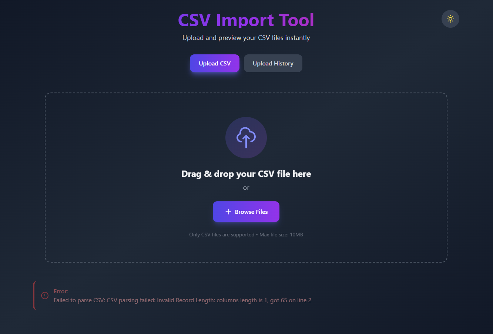

# CSV Import Application

A full-stack application for importing and processing CSV files, built with NestJS (backend) and React + Vite (frontend).

## Features

### Backend (NestJS)

- 📤 Upload CSV files via REST API
- ✅ Automatic CSV parsing and validation
- 🔍 Type-safe responses with DTOs
- 🛡️ Input validation and error handling
- 📊 Upload history tracking with status (success, failed, processing)
- 📝 Automatic API documentation (Swagger ready)
- 🗄️ PostgreSQL database persistence
- 🐳 Docker support for easy database setup

### Frontend (React + Vite)

- 🎨 Modern, responsive UI with Tailwind CSS
- 🌙 Dark mode support
- ✨ Glassmorphism design effects
- 🎭 Smooth animations and micro-interactions
- 📤 Drag & drop file upload
- 📊 CSV data preview in a table format
- 📋 Upload history view with status filtering
- ⚡ Fast development with Vite
- 🔄 Loading states and error handling
- 📱 Mobile-friendly design

## Screenshots

### Main Dashboard - Upload Interface (Light Mode)


_Modern glassmorphism upload area with drag & drop functionality. Features a clean, minimalist design with purple gradient accents and intuitive file upload interface._

### Dark Mode View


_Beautiful dark theme with gradient backgrounds and glassmorphism effects. The dark mode provides a comfortable viewing experience with purple accents and smooth transitions._

### CSV Preview - Successful Import


_Clean table view showing imported CSV data with success indicators. Displays all columns and rows in a well-organized, scrollable table format with clear visual feedback._

### Upload History Dashboard


_Comprehensive history view with status filtering and statistics. Shows all upload attempts with their status (Success/Failed/Processing), file sizes, row counts, timestamps, and error messages. Includes filter buttons to view specific status types._

### Error Handling View


_User-friendly error display showing parsing failures with clear error messages. Helps users understand what went wrong during CSV import attempts._

### Additional Screenshots (Coming Soon)

- **Filtered History** - View showing uploads filtered by status
- **Data Modal View** - Modal popup displaying detailed CSV data
- **Swagger API Documentation** - Interactive API docs for developers
- **Mobile Responsive View** - Mobile-optimized interface

> **Screenshot Files:** Make sure to save your screenshots in the `screenshots/` folder with the exact filenames shown above (e.g., `upload-interface.png`, `dark-mode.png`, etc.)

## Prerequisites

- Node.js (v18 or higher)
- npm or yarn
- PostgreSQL (for data persistence)
  - Download: https://www.postgresql.org/download/
  - Or use Docker: `docker run --name postgres -e POSTGRES_PASSWORD=postgres -p 5432:5432 -d postgres`

## Installation

### Backend Setup

1. Navigate to the backend directory:

```bash
cd backend
```

2. Install backend dependencies:

```bash
npm install
```

3. Set up PostgreSQL database:

   - Create database: `CREATE DATABASE csv_import;`
   - Or use Docker: `docker run --name postgres -e POSTGRES_PASSWORD=postgres -p 5432:5432 -d postgres`

4. Configure environment variables:

   Create `.env` file in `backend/` directory:

   ```env
   DB_HOST=localhost
   DB_PORT=5432
   DB_USERNAME=postgres
   DB_PASSWORD=postgres
   DB_NAME=csv_import
   PORT=3000
   NODE_ENV=development
   ```

   See [DATABASE_SETUP.md](./backend/DATABASE_SETUP.md) for detailed database setup instructions.

### Frontend Setup

1. Navigate to the frontend directory:

```bash
cd frontend
```

2. Install frontend dependencies:

```bash
npm install
```

## Running the Application

### Backend (NestJS API)

1. Navigate to the backend directory:

```bash
cd backend
```

2. Start the backend API:

```bash
npm run start:dev
```

The API will be available at `http://localhost:3000`

### Frontend (React App)

In a new terminal, navigate to the frontend directory and start the frontend:

```bash
cd frontend
npm run dev
```

The frontend will be available at `http://localhost:5173`

### Quick Start (Both Services)

**Terminal 1 - Backend:**

```bash
cd backend
npm run start:dev
```

**Terminal 2 - Frontend:**

```bash
cd frontend
npm run dev
```

Then open `http://localhost:5173` in your browser!

### Production mode

**Backend:**

```bash
cd backend
npm run build
npm run start:prod
```

**Frontend:**

```bash
cd frontend
npm run build
npm run preview
```

## API Documentation

### Swagger/OpenAPI Interactive Documentation

The API includes automatic Swagger documentation for easy testing and exploration:

**Access Swagger UI:**

```
http://localhost:3000/api-docs
```

**Features:**

- 📖 Interactive API documentation
- 🧪 Test endpoints directly from browser
- 📋 View request/response schemas
- 💡 See example requests and responses

**For other developers:** Share the Swagger URL when the server is running.

**OpenAPI JSON Specification:**

```
http://localhost:3000/api-docs-json
```

(Can be imported into Postman or other API clients)

---

## API Endpoints

### Health Check

```
GET /health
```

### Upload CSV File

```
POST /csv-import/upload
Content-Type: multipart/form-data

Body:
  file: <CSV file>
```

**Example using cURL:**

```bash
curl -X POST http://localhost:3000/csv-import/upload \
  -F "file=@path/to/your/file.csv"
```

**Example using Postman:**

1. Method: POST
2. URL: `http://localhost:3000/csv-import/upload`
3. Body → form-data
4. Key: `file` (type: File)
5. Select your CSV file

### Get Upload History

```
GET /csv-import/history
GET /csv-import/history?status=success
GET /csv-import/history?status=failed
GET /csv-import/history?status=processing
```

**Query Parameters:**

- `status` (optional): Filter by status (`success`, `failed`, `processing`)

**Example using cURL:**

```bash
curl http://localhost:3000/csv-import/history
curl http://localhost:3000/csv-import/history?status=success
```

### Get Upload by ID

```
GET /csv-import/history/:id
```

**Example using cURL:**

```bash
curl http://localhost:3000/csv-import/history/1234567890-abc123
```

## Response Format

**Success Response (Upload):**

```json
{
  "success": true,
  "message": "CSV file imported successfully",
  "data": [
    {
      "column1": "value1",
      "column2": "value2"
    }
  ],
  "totalRows": 1,
  "uploadId": "1234567890-abc123"
}
```

**Upload History Response:**

```json
{
  "uploads": [
    {
      "id": "1234567890-abc123",
      "fileName": "data.csv",
      "fileSize": 1024,
      "status": "success",
      "uploadedAt": "2024-01-01T12:00:00.000Z",
      "completedAt": "2024-01-01T12:00:01.000Z",
      "totalRows": 10,
      "message": "CSV file imported successfully"
    },
    {
      "id": "1234567890-xyz789",
      "fileName": "invalid.csv",
      "fileSize": 512,
      "status": "failed",
      "uploadedAt": "2024-01-01T11:00:00.000Z",
      "completedAt": "2024-01-01T11:00:00.500Z",
      "errors": ["CSV parsing failed: Invalid format"],
      "message": "Failed to parse CSV: Invalid format"
    }
  ],
  "total": 2,
  "success": 1,
  "failed": 1,
  "processing": 0
}
```

**Error Response:**

```json
{
  "statusCode": 400,
  "message": "Only CSV files are allowed",
  "error": "Bad Request"
}
```

## Project Structure

```
├── backend/                # Backend (NestJS)
│   ├── src/
│   │   ├── main.ts        # Application entry point
│   │   ├── app.module.ts  # Root module
│   │   ├── app.controller.ts
│   │   ├── app.service.ts
│   │   └── csv-import/
│   │       ├── csv-import.module.ts
│   │       ├── csv-import.controller.ts
│   │       ├── csv-import.service.ts
│   │       └── dto/
│   │           └── csv-import-response.dto.ts
│   ├── package.json
│   └── tsconfig.json
│
└── frontend/               # Frontend (React + Vite)
    ├── src/
    │   ├── components/
    │   │   ├── CsvUploader.tsx
    │   │   └── CsvPreview.tsx
    │   ├── services/
    │   │   └── api.ts
    │   ├── types/
    │   │   └── index.ts
    │   ├── App.tsx
    │   └── main.tsx
    ├── package.json
    └── vite.config.ts
```

## Example CSV Format

```csv
name,email,age
John Doe,john@example.com,30
Jane Smith,jane@example.com,25
```

## Customization

You can customize the CSV parsing behavior in `backend/src/csv-import/csv-import.service.ts`:

- Add custom validation rules
- Transform data before returning
- Add database persistence
- Add additional processing logic

## Testing

**Backend:**

```bash
cd backend
npm run test          # unit tests
npm run test:e2e      # e2e tests
npm run test:cov      # test coverage
```

**Frontend:**

```bash
cd frontend
npm run lint          # linting
```

## Exposing APIs to Other Developers

See [API_DOCUMENTATION.md](./backend/API_DOCUMENTATION.md) for detailed guide on:

- How to share APIs with other developers
- Swagger documentation access
- Network access configuration
- Deployment options
- Code examples for different languages
- Postman collection import

## License

MIT
